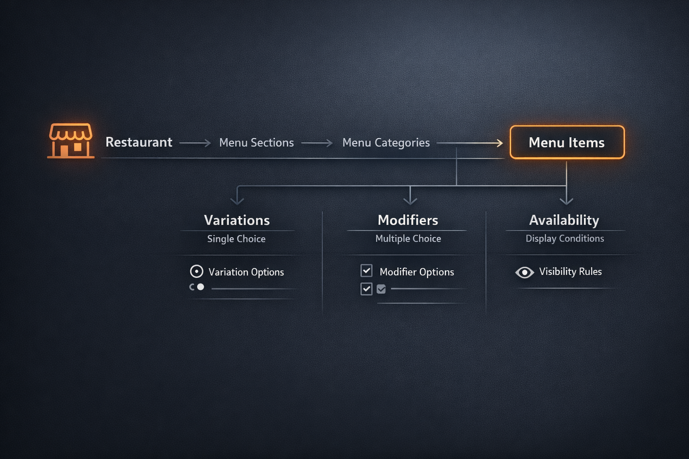

# Generic CRUD Menu Platform
Generic CRUD platform for menu domain services with extensible resource-specific workflows.

This project uses a hybrid generic architecture.

The generic base repository, service, and API flow are first-class parts of the design. They provide the default lifecycle behavior for simple entities. When an entity requires aggregate-specific behavior, child writes, association writes, special validation, or explicit transaction orchestration, it extends the base flow with custom repository methods, service methods, and endpoints.

> The goal is to show reusable architecture without pretending every business workflow is generic CRUD.

## Key goals
- reusable generic CRUD core
- resource-specific extension points
- transaction-safe multi-write flows
- explicit boundaries between generic lifecycle and custom aggregate logic

## Architecture overview
- internal/platform/crud - reusable platform layer
- internal/resources/<entity> — resource implementations
- internal/domain — persistence/domain models
- internal/app — application bootstrap
- internal/pkg — infra helpers

## Tech stack

- Golang
- PostgreSQL (GORM)
- Fiber

## Domain model
- Restaurant
- MenuSection
- MenuCategory
- MenuItem
- Variation / VariationOption
- Modifier / ModifierOption
- MenuAvailability

## Request lifecycle
> HTTP -> generic handler -> generic service -> hooks -> repository -> transaction manager -> response mapper

## Example API routes
- `/api/restaurants`
- `/api/menu-section`
- `/api/menu-category`
- `/api/menu-item`
- `/api/variation`
- `/api/modifier`
- `/api/menu-availability`
- `/api/menu-availability/batch`

## Future improvements / roadmap
- Uber Eats integration
- external provider sync
- auth
- migrations instead of AutoMigrate
- observability